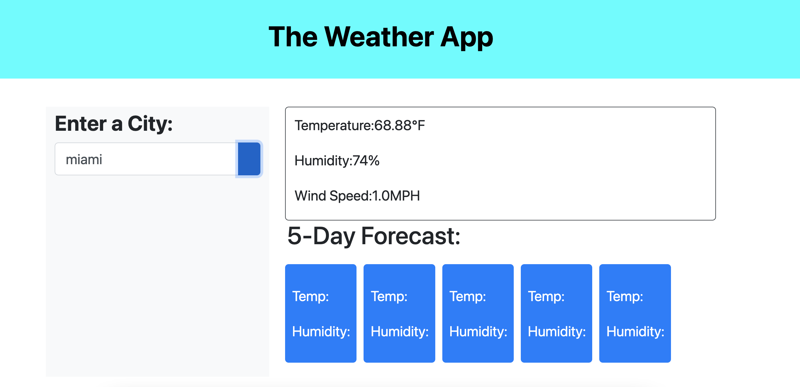
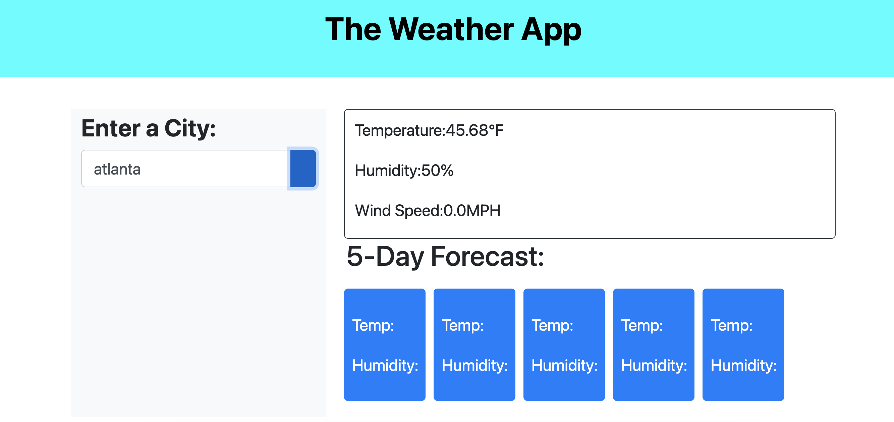

# 06-weather-dashboard
https://bballplayer33.github.io/06-weather-dashboard/

### Discribtion
The idea is to make a weather dashboard that displays the current day, gives a five day forcast, and shows a recent search list.

### Usage 

Showing Miami in its current time and day.

Showing Atlanta in its current day in time.

### Conclusion
Still working on fixing the api for five day forcast and figuring out the recent searches. Looking into the console log errors to fix.